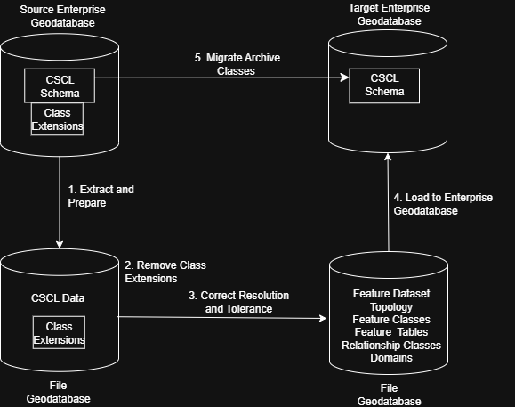

## cscl-migrate

We wish to migrate the New York City Citywide Street Centerline (CSCL) database from its legacy environment to some fancy new environments. Friends this our CSCL migration, our rules, the trick is never to be afraid.

The New York City Department of City Planning will produce the editing software in the target environment.  This repo is initially focused on migrating data to support this future software development.

### Overall Migration Plan

Here's a picture of the big picture.



### 1. Extract and Prepare CSCL

Review and update the environmentals.

```sh
> geodatabase-scripts\sample-cscl-extract.bat
```

What does that do?  Glad you asked. 

It creates an empty file geodatabase. Then it use python 2 arcpy with class extension readers to copy/paste from the Enterprise Geodatabase to cscl-migrate.gdb. 

    \[dev|stg|prd]\cscl-migrate.gdb

### 2. Remove class extensions from the file geodatabase

With ArcClassic ArcCatalog 10.7 or superior. 

1. Double click src/addin/ResetCLSIDs.esriaddin. In the utility window select "Install Add-In."  No admin rights required.
2. From ArcCatalog select Customize-Customize Mode - Toolbars. Create a new toolbar named your choice and check the box next it.
3. From ArcCatalog Customize-Customize Mode select the commands tab.  Search  for "Reset CLSIDs." Drag it to the toolbar.
🔴DANGER ZONE. CODE RED🔴
4. In ArcCatalog select the file geodatabase and run the ResetCLSIDs AddIn.
5. It should be quick and return "Completed without errors"
6. Review the log. It should look (confusingly) like the snippet below
7. Remove the toolbar. 🟡CODE YELLOW🟡
```
Inspecting item 'AddressPoint', OID: 73
	Expected CLSID equals Actual CLSID, no change needed.
	Expected EXTCLSID: 
	Actual EXTCLSID: {D9D37706-8C4F-4C38-8849-3C407FC0AC84}
Inspecting item 'ALTSEGMENTDATA', OID: 74
<snip>
```

### 3. Correct resolution and tolerance

Review and update the environmentals.

```bat
> geodatabase-scripts\sample-reprojectgdb.bat
```

### 4. Load to final Enterprise Geodatabase

```bat
> geodatabase-scripts\sample-cscl-load.bat
```

### 5. Migrate Archive Classes

WIP. See [doc/archive-migration.md](doc/archive-migration.md)


### 6. Teardown

To prevent catastrophe the teardown script will only proceed if there exists in the schema a registered feature table named UNLOCK_TEARDOWN. Manually create this empty feature table to allow teardown. 

```bat
> geodatabase-scripts\sample-cscl-teardown.bat
```


