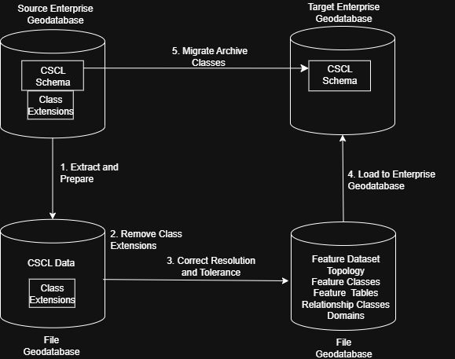

## cscl-migrate

We wish to migrate the New York City Citywide Street Centerline (CSCL) database from its legacy environment to some fancy new environments. Friends this our CSCL migration, our rules, the trick is never to be afraid.

The New York City Department of City Planning will produce the editing software in the target environment. This repo is initially focused on migrating data to support this future software development.

### Overall Migration Plan

Here's a picture of the big picture.



### You Will Need

1. arcpy from ArcGIS Pro 
2. arcpy from ArcMap (32 bit classic)
3. Classic 32 bit ArcCatalog (developed with 10.7.1)
4. ArcGIS Pro (developed with 3.5.x)
5. ArcGIS Pro Topographic Production toolbox license
6. sqlplus.exe
7. SQL access to the source database as the data owner and as SDE
8. SQL access to the target database as the data owner and as SDE


### 0. Stop Edits

Step 1 exports to a file geodatabase. The data flowing into that pipeline must continue to match the source environment until we export the archive in step 5.

### 1. Extract And Prepare CSCL

Review and update the environmentals in the batch file.

```sh
> geodatabase-scripts\sample-extract.bat
```

Step 1 creates an empty file geodatabase. Then it uses python 2 Arcpy with class extension readers to copy/paste from the Enterprise Geodatabase to cscl-migrate.gdb. 

    \[dev|stg|prd]\cscl-migrate.gdb

### 2. Remove Class Extensions 

From classic ArcCatalog 10.7 or superior. Administrator rights not required.

1. Double click src/addin/ResetCLSIDs.esriaddin. In the utility window select "Install Add-In."  
2. From ArcCatalog select Customize-Customize Mode - Toolbars. 
3. Create a new toolbar named "removecalss" and check the box next it.
4. From ArcCatalog Customize-Customize Mode select the commands tab. Search  for "Reset CLSIDs." Drag it to the toolbar.
🔴DANGER ZONE. CODE RED🔴
5. In ArcCatalog select the file geodatabase. 
6. Click the ResetCLSIDs toolbar button.
7. _Pause_ _for_ _a_ _moment_. Verify that the "GDB to modify" is a file geodatabase.
8. Fill in the output log location and click OK.
9. It should be quick and return: "Completed without errors."
10. Review the log. 
11. Remove the toolbar. 🟡CODE YELLOW🟡
12. Sanity check success by viewing the file geodatabase from ArcGIS Pro.

### 3. Correct Resolution And Tolerance

Review and update the environmentals in the batch file.

```bat
> geodatabase-scripts\sample-reprojectgdb.bat
```

This step will include a warning "CSCL_Topology is missing!" This is expected. We will manually recreate the topology in the next step. There will also be warnings about datasets with no records. This is just how CSCL is. CSCL is a place of sky high blue tomorrows.

### 4. Load To Enterprise Geodatabase

The default .bat files above output a reprojected file geodatabase named cscl-migrate-reproj.gdb. Using ArcGIS Pro copy all items in the file geodatabase. Paste into the enterprise geodatabase. 

This should run for about an hour. This step can't be scripted easily, only the magic GUI can deal with dependencies and avoid _1s.

Then complete the load by applying topology rules, versioning, grants, etc with this script.

```bat
> geodatabase-scripts\sample-post-load-processing.bat
```

### 5. Migrate Archive Classes

When migrating the archive we will update the base table objectids on the target database. These base tables do not exist until successfully completing step 4. Do not get clever and think that archive migration can be run in parallel to earlier steps.

See [doc/archive-migration.md](doc/archive-migration.md) for details.

First compile 2 pl/sql packages in the source and target. 

```bat
sqlplus sde/****@srcdb @geodatabase-scripts\setup-sde-source.sql
sqlplus sde/****@targetdb @geodatabase-scripts\setup-sde-target.sql
sqlplus cscl/****@targetdb @geodatabase-scripts\setup-owner-target.sql
```

Then migrate. This will transfer all archive data and update object ids on the target. 

```bat
> geodatabase-scripts\sample-migrate-archive.bat
```

### 6. Manually Migrate Failed Archive Classes

#### 6a. Manually Migrate Catastrophically Failed Archive Classes

Review the archive migration logs, especially the final verifycounts-*.log. One or two _H tables consistently fail to transfer completely and will require attention. Don't read into the ESRI errors that indicate memory issues.  "Memory" in this context appears to refer to some sort of internal constructor step, not memory exhaustion.

We will use HURRICANEEVACUATIONZONE in the examples below. 

1. Source: Reveal the _H table. From an SQL prompt connected as CSCL.

```sql
> call sde.nyc_archive_utils.reveal_history('HURRICANEEVACUATIONZONE');
```

2. Using ArcCatalog classic ([reminder why](https://github.com/mattyschell/cscl-migrate/issues/11)) manually copy/paste HURRICANEEVACUATIONZONE_H from source to target. This step may take a suspiciously long time. 

3. Target: Update the values in src/sql/sample_finalize_one_archive.sql or use a premade src\sql\finalize_*_archive.sql script if we have been through these steps before.

```bat
> sqlplus %TARGETSCHEMA%/"%TARGETPASSWORD%"@%TARGETDB% @src/sql/sample_finalize_one_archive.sql
```

4. Source: Conceal the history table

```sql
> call sde.nyc_archive_utils.conceal_history('HURRICANEEVACUATIONZONE');
```

#### 6b. Manually Migrate Partially Transferred Archive Classes

These steps apply to _H tables that exist and are populated with some, but not all, rows. We will use SCHOOLDISTRICT as the example. 

The steps must be followed precisely ([details](https://github.com/mattyschell/cscl-migrate/issues/28)). 

1. Target: Using ArcGIS Pro disable archiving and choose the option to delete the _H table

2. Source: Reveal the _H table. From an SQL prompt connected as CSCL.

```sql
> call sde.nyc_archive_utils.reveal_history('SCHOOLDISTRICT');
```

3. Using ArcCatalog classic ([reminder why](https://github.com/mattyschell/cscl-migrate/issues/11)) manually copy/paste SCHOOLDISTRICT from source to target. This step may take a suspiciously long time. 

4. Target: Update the values in src\sql\sample_finalize_one_archive.sql or use a premade src\sql\finalize_*_archive.sql script if it exists.

```bat
> sqlplus %TARGETSCHEMA%/"%TARGETPASSWORD%"@%TARGETDB% @src/sql/sample_finalize_one_archive.sql
```

5. Source: Conceal the history table

```sql
> call sde.nyc_archive_utils.conceal_history('SCHOOLDISTRICT');
```

#### 6c. Rerun Verification

```bat
> geodatabase-scripts\sample-rerun-verification.bat
```


### Teardown 

To prevent catastrophe the teardown script will only proceed if a registered table named UNLOCK_TEARDOWN exists in the schema. Manually create this empty table to unlock teardown. 

```bat
> geodatabase-scripts\sample-teardown.bat
```

### Time Estimates

"A day."

| Step        | Duration in Hours        |
|-------------|--------------------------|
| 1. Extract And Prepare CSCL         | 1 |
| 2. Remove Class Extensions          | 0 |
| 3. Correct Resolution And Tolerance | .5 |
| 4. Load To Enterprise Geodatabase   | 1 |
| 5. Migrate Archive Classes          | 4  |
| Teardown                            | .1 |

