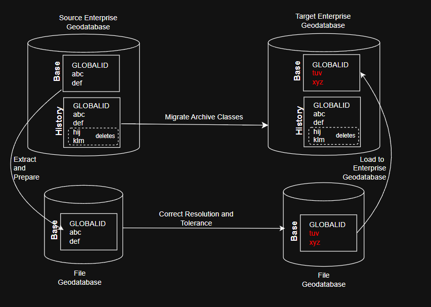
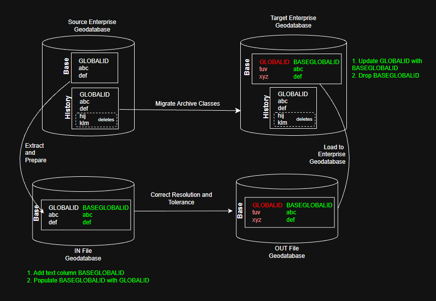

## Migrating Archive Classes

We will migrate CSCL via an interim step like a file geodatabase.  In this interim step we will lose the archive.

The CSCL maintenance team uses the archive to investigate the source of bad data.  There are also expectations for data retention from public safety outfits and next generation 911.

The steps below describe our preferred archive restoration strategy. This strategy is not supported by the COTS software.

### Confirm All Datasets Have a Globalid

The geodatabase does not guarantee objectid consistency during the base data migration. Globalids will serve as a persistent unique identifier.

At the conclusion of the migration, the base table must retain its source GLOBALID values in a column named GLOBALID. The copied _H table must also retain a column named GLOBALID and should contain a superset of the base table GLOBALIDs.

This requirement is the hard part of the workflow. The file geodatabase reprojection step creates fresh target GlobalIDs during load, so the source GlobalIDs must either survive the intermediate processing directly or be restored later without damaging geodatabase behavior.

See doc\confirm-globalid.sql for helper sql.




### Compile Packages

Compile 2 packages in 3 schemas. SDE source, SDE target, and data owner target.

```bat
sqlplus sde/****@srcdb @geodatabase-scripts\setup-sde-source.sql
sqlplus sde/****@targetdb @geodatabase-scripts\setup-sde-target.sql
sqlplus cscl/****@targetdb @geodatabase-scripts\setup-owner-target.sql
```

### Migrate Archive

In the commit history of this file we started with 3 archive migration strategies. This one was creatively named "approach 2" in our initial exploration.

1.	Copy the feature class to the target schema. It will be registered with the geodatabase. Register as versioned. Do not register as archiving.

In the real workflow the data will move to the target via an interim file geodatabase or two. The file geodatabase processing will involve all datasets and can take place prior to or in parallel to the archive steps below.

During this base data migration, preserve the source GLOBALID values for each base table so they can be restored to the target base table GLOBALID column before the archive workflow is finalized. The target base tables created by the reprojection process will otherwise contain fresh managed GlobalIDs.



2.	Source: Make the _H table visible to ESRI clients.

Call from CSCL to this utility in SDE. Then refresh the ESRI client to see the _H table.

```sql
call sde.nyc_archive_utils.reveal_history('BOROUGH');
```

3.	Copy the _H table to target schema using 32 bit ESRI clients and paste-NOT-special. It will be named FEATURECLASSNAME_H (or similar) just like the source.

4. Source: Hide _H table from ESRI clients.

```sql
call sde.nyc_archive_utils.conceal_history('BOROUGH');
```

5. Target: objectid update 

The row count in the base table should be less than the _H table. The _H table contains a superset of all possible objectids. Unmatched objectids will exist in _H. This is OK they are history.

Since objectids don't matter to anyone (they are synthetic keys) we will update the base table objectids to match their _H table bretheren and sisteren. Then we will modify the feature class objectid sequence.

This join assumes the target base table can still be matched to the copied _H table by GLOBALID. If an intermediate temporary column is used during reprojection, it must support restoring the final base GLOBALID values before archive registration is completed.

```sql
call cscl.owner_archive_utils.update_base_ids('BOROUGH');
```

6. Target: Restore source GLOBALID values to the base table GLOBALID column.

This step is required for the final state of the migration. The base table GLOBALID values must match the source data, while the copied _H table GLOBALID values remain a superset of the base table.

This step must be validated carefully. Directly overriding geodatabase-managed GlobalIDs may or may not be tolerated by ArcGIS and the enterprise geodatabase. Before adopting this as the standard workflow, test one representative archived feature class end to end, including versioning, archive registration, ArcGIS Describe behavior, and ordinary edit/read operations.

7. Target: Manually “register” the parent as archiving and _H table is the history table. Call from CSCL to this utility in SDE.

Archive date should be set to archive_date in the source sde.table_registry. 

```sql
call sde.nyc_archive_utils.register_archiving('BOROUGH',1273245334);
```

The copied _H table must be concealed. Call from CSCL on the target.

```sql
call sde.nyc_archive_utils.conceal_history('BOROUGH');
```
